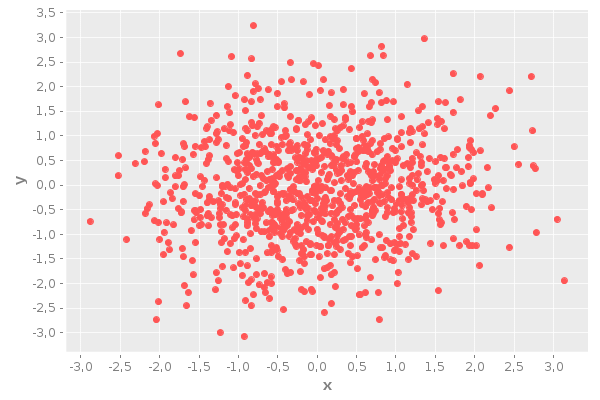

# Syntaxe: (function params)


```clojure
(println (str "Date:\t\t\t" (java.util.Date.)))
(println (apply format "Clojure version:\tv%d.%d" ((juxt :major :minor) *clojure-version*)))
(println (str "Clojupyter version:\t" (clojupyter.kernel.version/version-string)));
```

    Date:			Mon Jun 15 15:04:46 CEST 2020
    Clojure version:	v1.10
    Clojupyter version:	0.3.2


```clojure
(def hello (fn [] "Hello world"))
```


    #'user/hello


```clojure
(hello)
```


    "Hello world"


```clojure
(defn argcount
  ([] 0)
  ([x] 1)
  ([x y] 2)
  ([x y & more] (+ (argcount x y) (count more))))
```


    #'user/argcount


```clojure
(argcount)
```


    0


```clojure
(argcount 1)
```


    1


```clojure
(argcount 1 2)
```


    2


```clojure
(argcount 1 2 3 4 5)
```


    5


```clojure
(let [my-vector [1 2 3 4]
      my-map {:fred "ethel"}
      my-list (list 4 3 2 1)]
  (list
    (conj my-vector 5)
    (assoc my-map :ricky "lucy")
    (conj my-list 5)
    ;the originals are intact
    my-vector
    my-map
    my-list))
```


    ([1 2 3 4 5] {:fred "ethel", :ricky "lucy"} (5 4 3 2 1) [1 2 3 4] {:fred "ethel"} (4 3 2 1))


```clojure
(require '[clojupyter.display :as display])
```


    nil


```clojure
;; displaying html
(display/hiccup-html 
    [:ul 
     [:li "a " [:i "emphatic"] " idea"]
     [:li "a " [:b "bold"] " idea"]
     [:li "an " [:span {:style "text-decoration: underline;"} "important"] " idea"]])
```


<ul><li>a <i>emphatic</i> idea</li><li>a <b>bold</b> idea</li><li>an <span style="text-decoration: underline;">important</span> idea</li></ul>


```clojure
(display/hiccup-html
    [:svg {:height 100 :width 100 :xmlns "http://www.w3.org/2000/svg"}
            [:circle {:cx 50 :cy 40 :r 40 :fill "red"}]])
```


<svg height="100" width="100" xmlns="http://www.w3.org/2000/svg"><circle cx="50" cy="40" fill="red" r="40"></circle></svg>


```clojure
(->> clojupyter/*logo* type (str "Logo is of type: ") println)
clojupyter/*logo*
```

    Logo is of type: class java.awt.image.BufferedImage


```clojure
(display/render-mime "text/plain" "This is plain text.")
```


    This is plain text.


```clojure
(display/render-mime "text/html" "<h1>This is a heading</h1>")
```


<h1>This is a heading</h1>


```clojure
;; do not use VPN
(require '[clojupyter.misc.helper :as helper])
(helper/add-dependencies '[incanter "1.5.7"])
(use '(incanter core stats charts io)) ; include Incanter's facilities into working namespace
:ok
```


    :ok


```clojure
(-> (sample-normal 10000)
    histogram
    (.createBufferedImage 600 400))
```


```clojure
(-> (scatter-plot (sample-normal 1000) 
                  (sample-normal 1000)
                  :x-label "x" :y-label "y")
    (.createBufferedImage 600 400))
```





```clojure
clojupyter/*license*
```


    Copyright (c) 2014 Rory Kirchner
    
    Permission is hereby granted, free of charge, to any person obtaining
    a copy of this software and associated documentation files (the
    "Software"), to deal in the Software without restriction, including
    without limitation the rights to use, copy, modify, merge, publish,
    distribute, sublicense, and/or sell copies of the Software, and to
    permit persons to whom the Software is furnished to do so, subject to
    the following conditions:
    
    The above copyright notice and this permission notice shall be
    included in all copies or substantial portions of the Software.
    
    THE SOFTWARE IS PROVIDED "AS IS", WITHOUT WARRANTY OF ANY KIND,
    EXPRESS OR IMPLIED, INCLUDING BUT NOT LIMITED TO THE WARRANTIES OF
    MERCHANTABILITY, FITNESS FOR A PARTICULAR PURPOSE AND
    NONINFRINGEMENT. IN NO EVENT SHALL THE AUTHORS OR COPYRIGHT HOLDERS BE
    LIABLE FOR ANY CLAIM, DAMAGES OR OTHER LIABILITY, WHETHER IN AN ACTION
    OF CONTRACT, TORT OR OTHERWISE, ARISING FROM, OUT OF OR IN CONNECTION
    WITH THE SOFTWARE OR THE USE OR OTHER DEALINGS IN THE SOFTWARE.


